# VoteChain
Vote chain is a cross-OS mobile app that allows users to create, participate and observe polls of every kind: Politics, economics, sports, culture, general opinion, trends, etc. All of this powered with **blockchain** technology to perform a secure, confidencial, inmmutable and clean votation in every possible user necessity related with voting.

## Technologies and architecture

### Frontend

#### Technlogies
- React native: All the UI was coded using this platform.
- JavaScript: Was used for the main view JS.
- TypeScript: The components of the main views and other documents were made with Typescript.
#### Architecture
- Tabs and Stack wiring using Expo.
- App folder contains the wiring and all the Views.
- Components folder contains the individual components of each views.
   
### Backend

#### Technologies
- NodeJS: NodeJS as Javascript platform to code the project.
- JavaScript: Base programming language.
- ExpressJS: Framework for API REST construction.
- MongoDB: Selected database with capability of large amount of polls information.
- Docker: Used to put the MongoDB server inside of a OCI instance.
- Oracle Cloud Interface (OCI): Used for Database and backend availability storing thm in OCI instances.
- Metamask: Used to make an account to be able the sign when voting uing blockchain with Sepolia. 
- OpenZepellin: Used so that different users could sign with ther I using one MetaMask account avoiding them to create an account when using the app.
- Sepolia Testnet (Ethereum): Ethereum blockchain based net to make tests regarding blockchain transactions when voting.
  
#### Architecture
- Model Controller Routes (MCR) architecture for each database structure.

## Project structure
```
VoteChain/
│
├── Frontend/            # React Native mobile application
│   ├── App/             # Screens and navigation logic
│   └── Components/      # UI elements
│
├── Backend/             # Express.js API
│   ├── controllers/     # Business logic
│   ├── models/          # Mongoose schemas
│   └── routes/          # API routing
│
├── ReadmeImages/        # Image assets used in documentation
└── README.md            # Project documentation
```

## Use cases

### Creating a poll
<p align="center">
   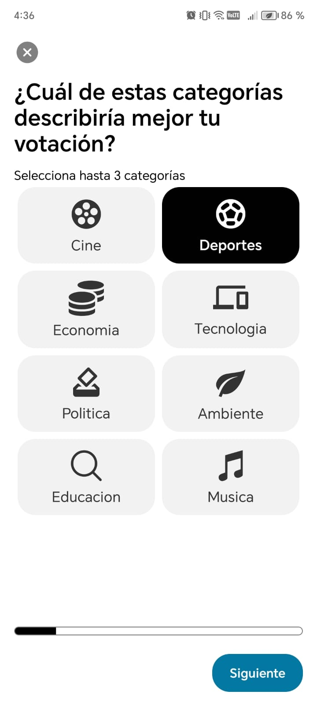
   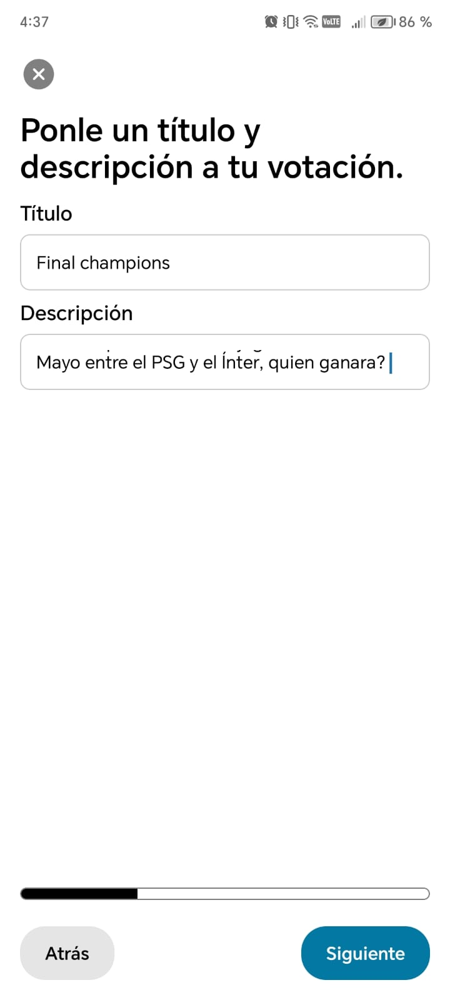
   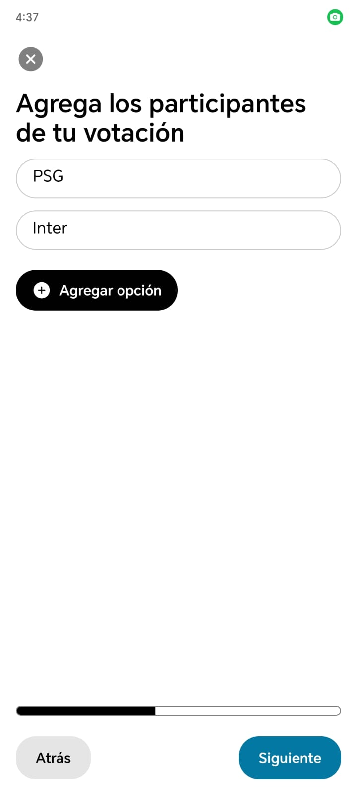
   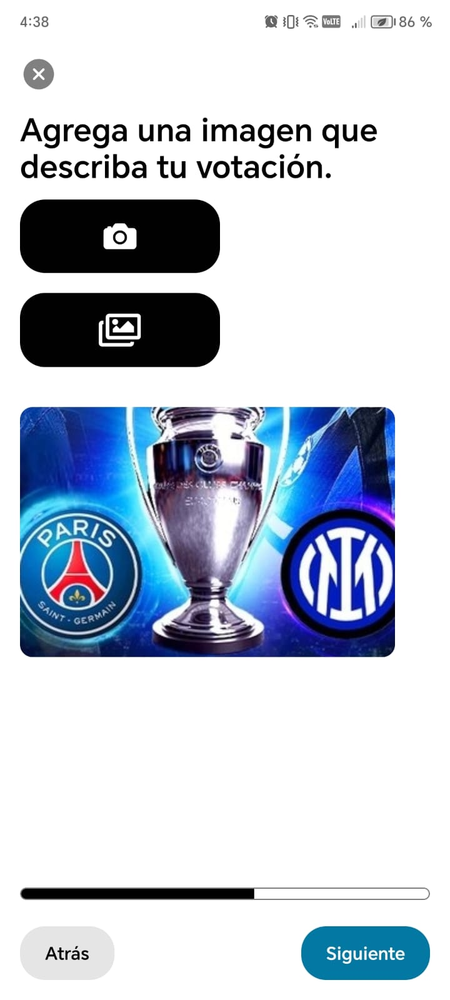
   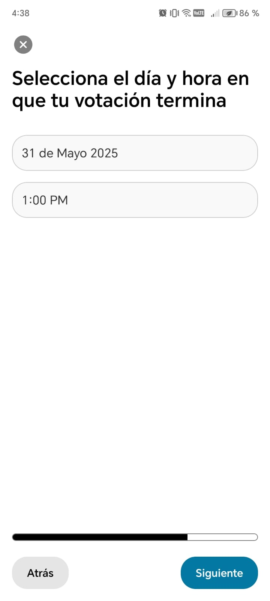
   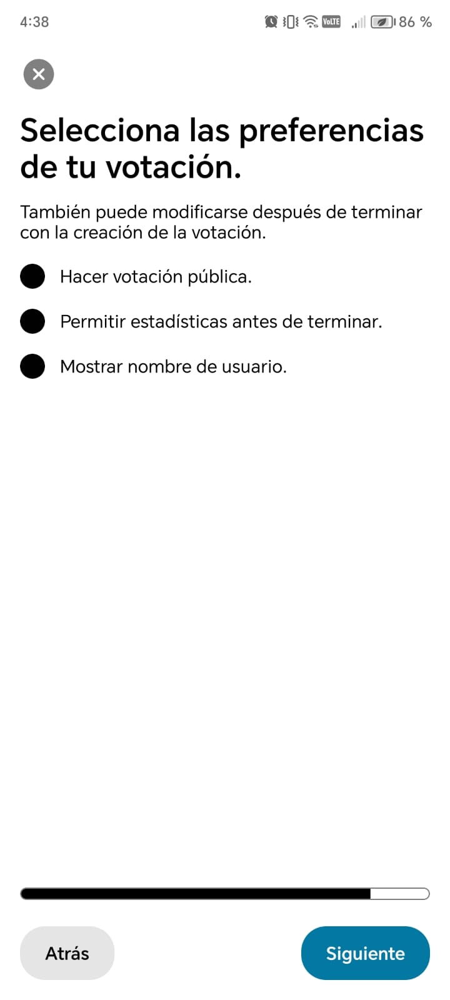
   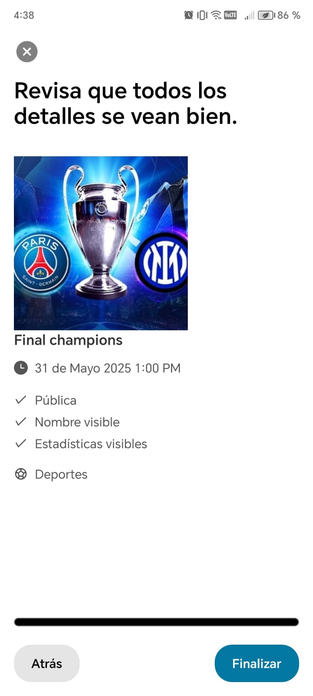
</p>

### Voting
<p>
   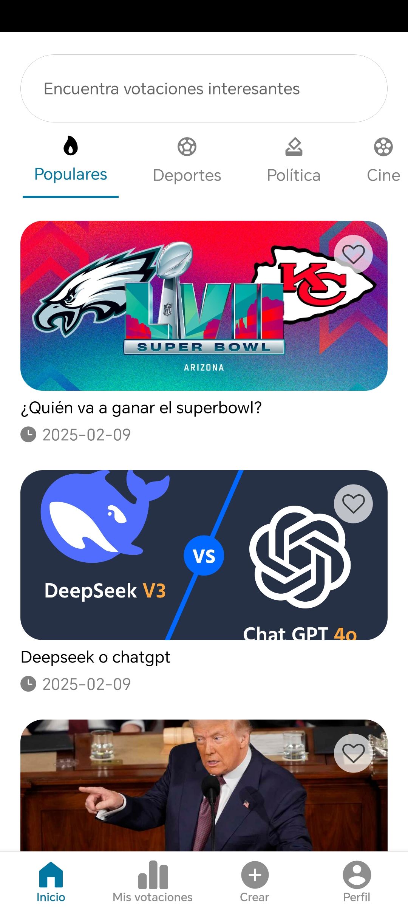
   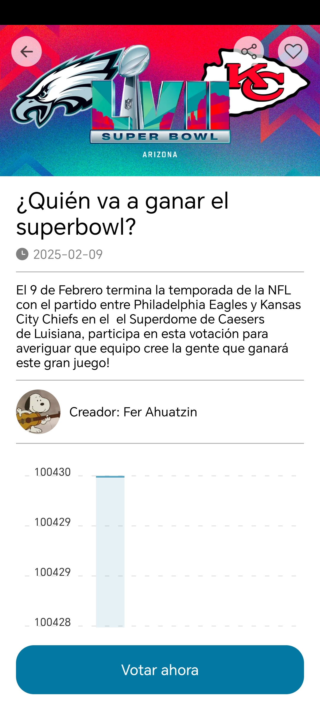
   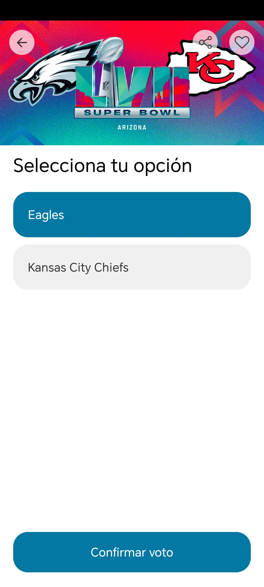
</p>

### Changing profile information
<p>
   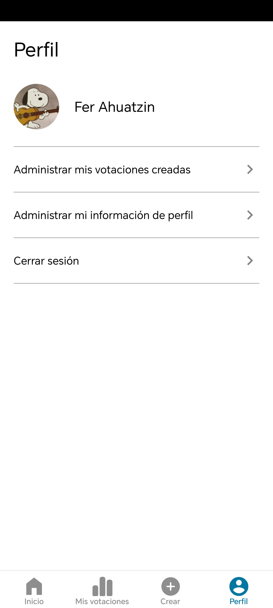
   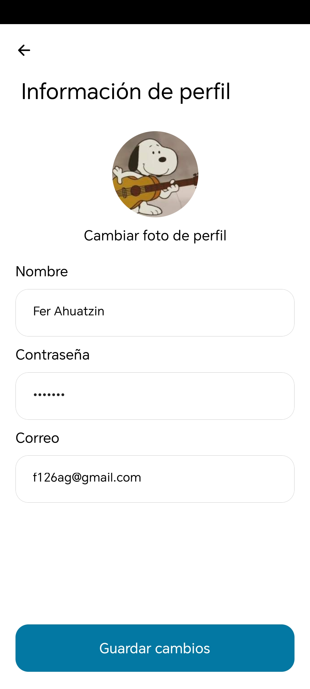
</p>

## Blockchain Features
- Every vote is signed with MetaMask and recorded in the Sepolia blockchain using a smart contract.
- Signatures are validated using OpenZeppelin contracts that allow multiple users to sign transactions under a common account.
- The blockchain ensures one vote per user by associating votes with unique Ethereum addresses.
- Vote data remains immutable and verifiable through the blockchain explorer.

## Running project
- Clone repo
- Install Node js.

### Frontend developers

#### Requirements
- If working on Windows and wanting to run it on an emulator install Android studio, go to tools, device manager, enable an emulator or connect physical android device to computer.
- If working on mac have Xcode and open the emulator if wanting to run it on an emulator.
- If working with an Android physical device install Expo mobile.
- If working with an iOS physical device you ok. 

#### Steps 
- cd to VoteChain\Frontend
```
cd ...\VoteChain\Frontend
```
- Install the packages.
```
npm install
```
- Execute one of the following commands.
```
npm run start ##All running options including QR code to run it on your physical device

npm run android ## Run on android studio opening before the emulator

npm run ios ## You need to use macOS to build the iOS project - use the Expo app if you need to do iOS development without a Mac

```
- Upload the ip of the API calls if wanting to make tests to the one in which is running in your computer.

### Backend developers

#### Steps 
- cd to VoteChain\Backend
```
cd ...\VoteChain\Backend
```
- Install the packages.
```
npm install
```
- Execute the following command.
```
npm run start-local
```
